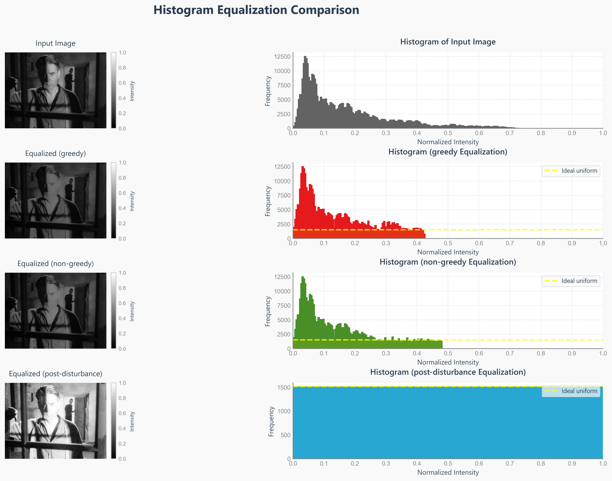
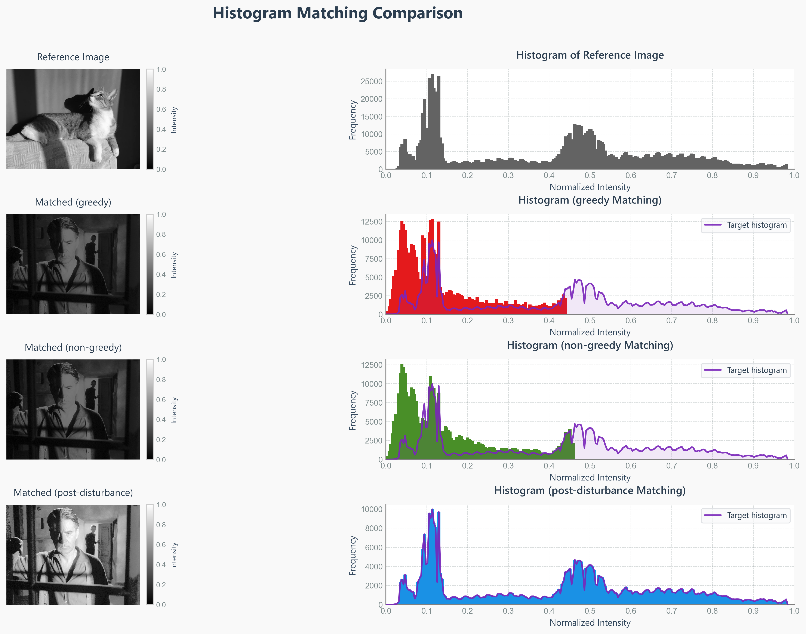

# Assignment 1: Histogram Processing and Modification
**Author:** Fraidakis Ioannis  
**Date:** April 2025  

This assignment implements and compares different algorithms for histogram equalization and histogram matching, demonstrating fundamental techniques for image enhancement through intensity distribution manipulation.

## Overview

Histogram processing is a cornerstone technique in digital image processing that modifies the intensity distribution of an image to improve visual quality or match specific statistical properties. This assignment explores three distinct approaches to histogram modification:

1. **Greedy Algorithm**: Sequential bin filling approach
2. **Non-Greedy Algorithm**: Balanced distribution approach  
3. **Post-Disturbance Algorithm**: Tie-breaking through controlled noise injection

## Project Structure

```
assignment-1/
├── docs/
│   ├── assignment-1.pdf           # Assignment specification
│   ├── report.pdf                 # Technical report
│   ├── report.tex                 # LaTeX source
│   └── input-images/
│       ├── input_img.jpg          # Primary test image
│       └── ref_img.jpg            # Reference image for histogram matching
├── results/
│   ├── histograms/                # Generated histogram plots
│   └── images/                    # Processed images and comparisons
└── src/
    ├── demo.py                    # Main demonstration script
    ├── hist_modif.py              # Core histogram modification algorithms
    ├── hist_utils.py              # Histogram calculation utilities
    ├── image_utils.py             # Image I/O and visualization utilities
    └── metrics.py                 # Quantitative evaluation metrics
```

## Key Features

### Histogram Equalization
- **Objective**: Transform image histogram to approximate uniform distribution
- **Benefit**: Enhances contrast by spreading intensity values across full dynamic range
- **Implementation**: Three different mapping strategies with varying characteristics

### Histogram Matching
- **Objective**: Transform image histogram to match a reference histogram
- **Benefit**: Allows precise control over output intensity distribution
- **Application**: Color correction, style transfer, and image standardization

### Algorithm Comparison
- **Greedy**: Fast, sequential approach with complete bin filling
- **Non-Greedy**: Balanced approach avoiding overfilling of intensity bins
- **Post-Disturbance**: Tie-breaking mechanism for improved distribution uniformity

## Algorithms Implemented

### 1. Greedy Histogram Modification
```python
def perform_hist_modification(img_array, hist_ref, mode='greedy'):
    """
    Assigns input intensities to output bins sequentially, completely 
    filling each bin before moving to the next.
    """
```
- **Characteristics**: Simple, deterministic mapping
- **Advantage**: Computationally efficient
- **Limitation**: May create abrupt intensity transitions

### 2. Non-Greedy Histogram Modification
```python
def perform_hist_modification(img_array, hist_ref, mode='non-greedy'):
    """
    Assigns input intensities while avoiding overfilling by checking
    if at least half of the pixels fit in the current bin.
    """
```
- **Characteristics**: Balanced distribution approach
- **Advantage**: Smoother intensity transitions
- **Trade-off**: More complex decision logic

### 3. Post-Disturbance Histogram Modification
```python
def perform_hist_modification(img_array, hist_ref, mode='post-disturbance'):
    """
    Adds small random noise to break ties, then applies greedy algorithm
    for improved histogram approximation.
    """
```
- **Characteristics**: Tie-breaking through controlled randomization
- **Advantage**: Better histogram matching accuracy
- **Application**: When precise statistical matching is required

## Quantitative Evaluation

The implementation includes comprehensive metrics for objective performance assessment:

### Mean Squared Error (MSE)
- Measures the average squared difference between achieved and target histograms
- Sensitive to differences at all intensity levels
- Lower values indicate better histogram matching

### Bhattacharyya Distance
- Quantifies similarity between probability distributions
- Less sensitive to outliers than MSE
- Bounded between 0 (identical) and ∞ (completely different)

### Earth Mover's Distance (EMD)
- Measures minimum cost to transform one histogram into another
- Accounts for perceptual differences between intensity levels
- Lower values indicate better histogram matching accuracy

The assignment generates comprehensive visualizations including:

### Histogram Equalization Results
- **Input**: Original image with its histogram
- **Output**: Equalized images using all three algorithms
- **Reference**: Ideal uniform distribution overlay
- **Metrics**: Quantitative comparison of histogram approximation quality



### Histogram Matching Results
- **Input**: Source image histogram
- **Target**: Reference image histogram  
- **Output**: Matched images with resulting histograms
- **Analysis**: Statistical evaluation of matching accuracy



## Key Insights

1. **Greedy Algorithm**: Fastest execution but may create artificial intensity clustering
2. **Non-Greedy Algorithm**: Best balance between accuracy and visual quality
3. **Post-Disturbance Algorithm**: Highest histogram matching accuracy but with computational overhead

## Academic Learning Objectives

This assignment demonstrates:
- **Histogram Analysis**: Understanding intensity distribution characteristics
- **Transform Design**: Creating mappings between input and output intensity spaces
- **Algorithm Comparison**: Evaluating trade-offs between different approaches
- **Quantitative Evaluation**: Using metrics to assess algorithm performance objectively
- **Visual Assessment**: Interpreting results through both statistical and perceptual analysis

---

**Course:** Digital Image Processing  
**Institution:** Aristotle University of Thessaloniki  
**Semester:** Spring 2025