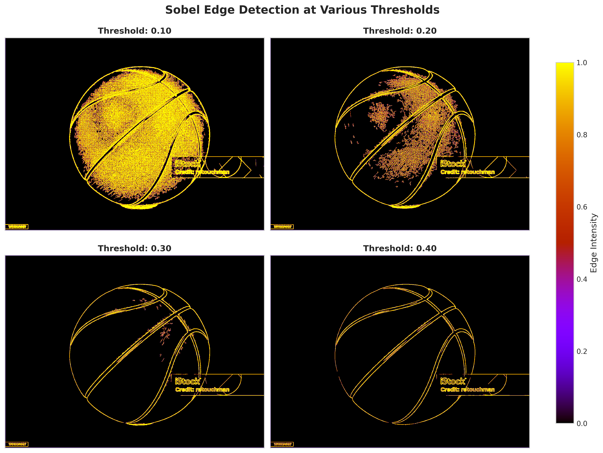
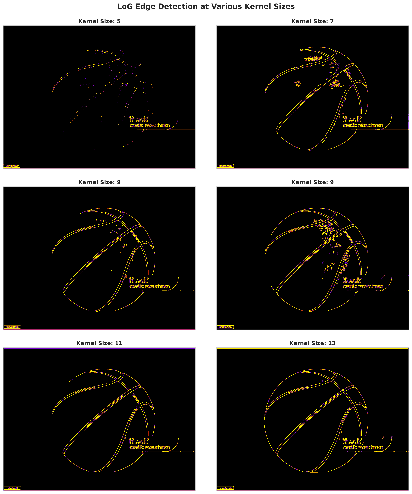
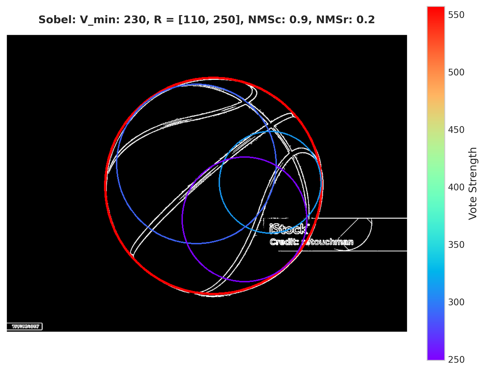
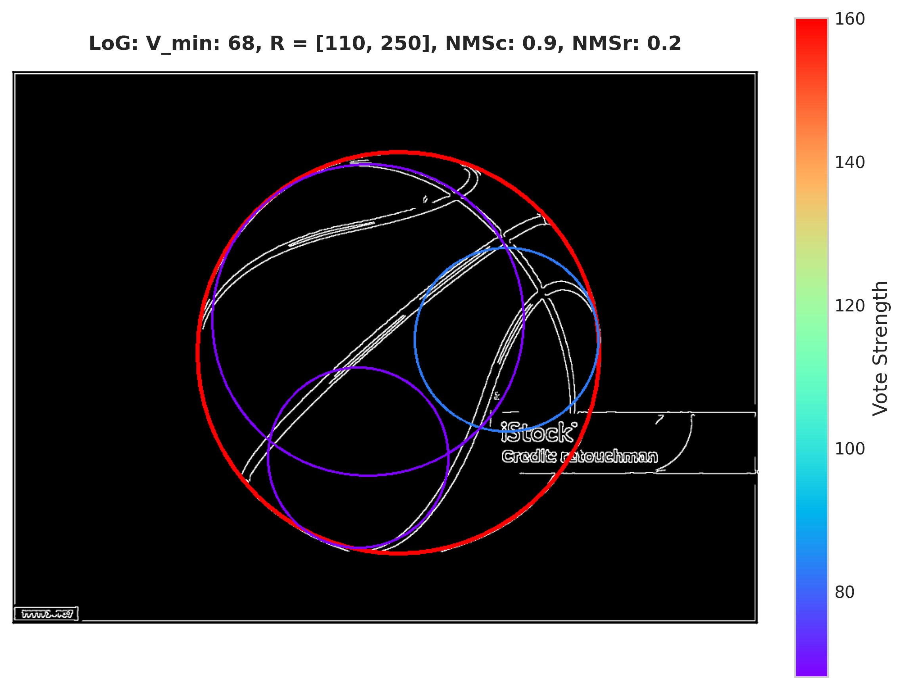

# Assignment 2: Edge Detection and Circle Detection
**Author:** Fraidakis Ioannis  
**Date:** May 2025  

This assignment implements and compares edge detection algorithms followed by circular Hough transform for geometric shape detection. It demonstrates the complete pipeline from low-level feature extraction to high-level object recognition.

## Overview

Edge detection and geometric shape recognition are fundamental components of computer vision systems. This assignment explores two complementary approaches:

1. **Edge Detection**: Identifying intensity discontinuities that correspond to object boundaries
2. **Circle Detection**: Using the Hough transform to detect circular objects in edge maps

The implementation covers both **Sobel edge detection** (gradient-based) and **Laplacian of Gaussian (LoG)** edge detection (second-derivative based), followed by **circular Hough transform** with advanced post-processing techniques.

## Project Structure

```
assignment-2/
├── docs/
│   ├── assignment-2.pdf           # Assignment specification
│   ├── input-image.png            # Primary test image (basketball)
│   ├── report.pdf                 # Technical report and analysis
│   └── report.tex                 # LaTeX source
├── results/
│   ├── hough/                     # Circle detection results
│   ├── log/                       # LoG edge detection results
│   └── sobel/                     # Sobel edge detection results
└── src/
    ├── demo.py                    # Main demonstration script
    ├── circ_hough.py              # Circular Hough transform implementation
    ├── fir_conv.py                # Finite impulse response convolution
    ├── log_edge.py                # Laplacian of Gaussian edge detection
    ├── result_refinement.py       # Post-processing utilities
    └── sobel_edge.py              # Sobel edge detection implementation
```

## Algorithms Implemented

### 1. Sobel Edge Detection

The Sobel operator detects edges by computing the gradient magnitude at each pixel using separable convolution kernels.

```python
def sobel_edge(in_img_array: np.ndarray, threshold: float) -> np.ndarray:
    """
    Detects edges using Sobel gradient operators.
    
    Args:
        in_img_array: Input grayscale image [0, 1]
        threshold: Gradient magnitude threshold for edge detection
    
    Returns:
        Binary edge map where 1 indicates detected edges
    """
```

**Key Features:**
- **Gradient Computation**: Separable convolution with Sobel kernels
- **Threshold Analysis**: Systematic evaluation of threshold impact
- **Edge Count Metrics**: Quantitative analysis of detected edges vs. threshold

**Sobel Kernels:**
```
Gx = [[-1, 0, 1],      Gy = [[-1, -2, -1],
      [-2, 0, 2],             [ 0,  0,  0],
      [-1, 0, 1]]             [ 1,  2,  1]]
```

### 2. Laplacian of Gaussian (LoG) Edge Detection

The LoG operator combines Gaussian smoothing with Laplacian second-derivative computation for robust edge detection.

```python
def log_edge(in_img_array: np.ndarray, kernel_size: int) -> np.ndarray:
    """
    Detects edges using Laplacian of Gaussian operator.
    
    Args:
        in_img_array: Input grayscale image [0, 1]
        kernel_size: Size of the Gaussian kernel (must be odd)

    Returns:
        Binary edge map from zero-crossing detection
    """
```

**Key Features:**
- **Scale-Space Analysis**: Multi-scale edge detection with varying σ values
- **Zero-Crossing Detection**: Identifying sign changes in the Laplacian response

### 3. Circular Hough Transform

The circular Hough transform detects circles by mapping edge pixels to parameter space (center coordinates and radius).

```python
def circ_hough(in_img_array: np.ndarray, R_max: float, dim: np.ndarray, 
               V_min: int, R_min: float) -> tuple:
    """
    Detects circles using the Hough transform in parameter space.
    
    Args:
        in_img_array: Binary edge map
        R_max: Maximum circle radius
        dim: Accumulator dimensions [a_bins, b_bins, r_bins]
        V_min: Minimum votes for circle detection
        R_min: Minimum circle radius
    
    Returns:
        Detected centers, radii, and vote counts
    """
```

**Key Features:**
- **3D Parameter Space**: (x_center, y_center, radius) accumulator
- **Voting Mechanism**: Each edge pixel votes for possible circle parameters
- **Non-Maximum Suppression**: Advanced post-processing to refine detections

## Parameter Tuning Guidelines

**Sobel Thresholds:**
- Low (0.1-0.15): Detects more edges, including noise
- Medium (0.2-0.25): Balanced edge detection
- High (0.3-0.4): Only strong edges, may miss details

**LoG Sigma Values:**
- Small σ (5-7): Fine-scale edges, more detail
- Medium σ (8-10): Balanced scale detection
- Large σ (11-13): Coarse-scale edges, smoother results

**Hough Parameters:**
- **R_min/R_max**: Expected circle size range
- **V_min**: Minimum confidence threshold (adjust based on image noise)
- **Accumulator Dimensions**: Balance between resolution and computation time

## Results and Visualizations

### Generated Outputs

1. **Sobel Results** (`results/sobel/`):
   - Individual threshold results
   - Threshold comparison grid
   - Edge count vs. threshold analysis

<br>

<div align="center">
  
</div>

<div align="center">
  <em>Sobel edge detection results with varying threshold values</em>
</div>

<br>

2. **LoG Results** (`results/log/`):
   - Multi-scale edge detection results  
   - Kernel size comparison
   - Comprehensive scale-space visualization

<br>

<div align="center">
  
</div>

<div align="center">
  <em>LoG edge detection results with varying sigma values for multi-scale analysis</em>
</div>


<br>

3. **Circle Detection** (`results/hough/`):
   - Detected circles overlaid on original image
   - Parameter-specific detection results
   - Comparative analysis between edge detectors

<br>

<div align="center">
  
  
</div>

<div align="center">
  <em>Circle detection results: Sobel-based (left) vs LoG-based (right) edge detection followed by Hough transform</em>
</div>

## Academic Learning Objectives

This assignment demonstrates:
1. **Gradient-Based Edge Detection**: Understanding first-derivative operators
2. **Scale-Space Theory**: Multi-scale image analysis with LoG operator
3. **Parameter Space Voting**: Hough transform methodology
4. **Post-Processing Techniques**: Non-maximum suppression and result refinement

---

**Course:** Digital Image Processing  
**Institution:** Aristotle University of Thessaloniki  
**Semester:** Spring 2025