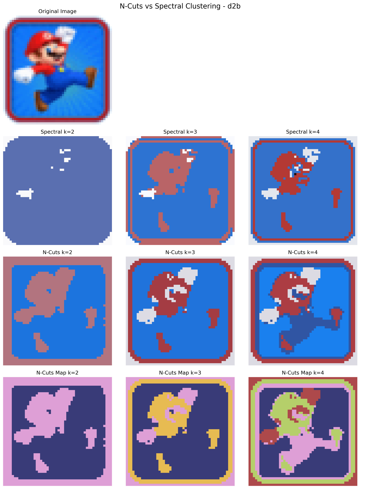

# Assignment 3: Image Segmentation with Spectral Clustering and Normalized Cuts
**Author:** Fraidakis Ioannis  
**Date:** June 2025  


This assignment implements advanced graph-based image segmentation techniques, including spectral clustering and normalized cuts (N-cuts). It demonstrates how to transform images into graph representations and apply sophisticated mathematical frameworks for semantic region partitioning.

## Overview

Image segmentation is one of the most challenging problems in computer vision, requiring the partitioning of images into semantically meaningful regions. This assignment explores state-of-the-art graph-theoretical approaches that model images as weighted graphs where pixels become vertices and similarity relationships become edges.

The implementation covers three major components:
1. **Image-to-Graph Conversion**: Transforming spatial image data into graph representations
2. **Spectral Clustering**: Eigenvalue-based clustering using graph Laplacians
3. **Normalized Cuts**: Optimization-based segmentation with recursive refinement

## Project Structure

```
assignment-3/
├── docs/
│   ├── assignment-3.pdf          # Assignment specification
│   ├── dip_hw_3.mat              # MATLAB data file with test matrices
│   ├── report.pdf                # Technical report and analysis
│   └── report.tex                # LaTeX source
├── results/
│   ├── demo1/                    # Spectral clustering on pre-built affinity
│   ├── demo2/                    # Image-to-graph conversion results
│   ├── demo3a/                   # Non-recursive N-cuts results
│   ├── demo3b/                   # Recursive N-cuts results
│   └── demo3c/                   # Advanced N-cuts with initialization
└── src/
    ├── demo1.py                  # Spectral clustering validation
    ├── demo2.py                  # Image-to-graph demonstration
    ├── demo3a.py                 # Non-recursive N-cuts
    ├── demo3b.py                 # Recursive N-cuts implementation
    ├── demo3c.py                 # Advanced N-cuts with custom initialization
    ├── demo_utils.py             # Shared utilities and visualization
    ├── image_to_graph.py         # Image-to-graph conversion algorithm
    ├── n_cuts.py                 # Normalized cuts implementation
    ├── spectral_clustering.py    # Spectral clustering algorithm
    └── run_all.py                # Execute all demonstrations
```

## Core Algorithms

### 1. Image-to-Graph Conversion

Transforms images into fully-connected weighted graphs where pixel similarity drives edge weights.

```python
def image_to_graph(img_array: np.ndarray) -> np.ndarray:
    """
    Convert image into fully-connected graph representation.
    
    Args:
        img_array: Input image [M, N, C] with values in [0, 1]
    
    Returns:
        Affinity matrix W where W[i,j] represents similarity between pixels i and j
    """
```

**Key Features:**
- **Spatial-Intensity Affinity**: Combines spatial proximity and intensity similarity
- **Gaussian Weighting**: Exponential decay based on feature distance
- **Multi-Channel Support**: Handles grayscale and color images
- **Computational Optimization**: Efficient vectorized operations

### 2. Spectral Clustering

Implements spectral clustering using the normalized graph Laplacian for dimensionality reduction followed by k-means clustering.

```python
def spectral_clustering(affinity_matrix: np.ndarray, k: int) -> np.ndarray:
    """
    Perform spectral clustering on affinity matrix.
    
    Args:
        affinity_matrix: Symmetric affinity matrix W
        k: Number of clusters
    
    Returns:
        Cluster labels for each data point
    """
```

**Mathematical Foundation:**
- **Graph Cut Theory**: Minimizes normalized cut criterion
- **Spectral Graph Theory**: Leverages eigenstructure of graph Laplacian
- **Relaxation**: Continuous relaxation of discrete partitioning problem

### 3. Normalized Cuts (N-Cuts)

Implements the normalized cuts algorithm for optimal graph partitioning with both non-recursive and recursive variants.

```python
def n_cuts(W: np.ndarray, k: int, recursive: bool = False) -> np.ndarray:
    """
    Perform normalized cuts segmentation.
    
    Args:
        W: Affinity matrix
        k: Number of segments
        recursive: Whether to use recursive bisection
    
    Returns:
        Segment labels for each pixel
    """
```

## Demonstration Programs

### Demo 1: Spectral Clustering Validation
```bash
python src/demo1.py
```
- **Purpose**: Validate spectral clustering on provided affinity matrix
- **Test Cases**: k = 2, 3, 4 clusters on controlled dataset
- **Output**: Cluster visualizations

### Demo 2: Image-to-Graph Conversion
```bash
python src/demo2.py  
```
- **Purpose**: Demonstrate image-to-graph transformation
- **Features**: Affinity matrix visualization, parameter sensitivity analysis
- **Output**: Graphs showing spatial and intensity relationships

### Demo 3a: Non-Recursive N-Cuts
```bash
python src/demo3a.py
```
- **Purpose**: Multi-way normalized cuts segmentation
- **Method**: Direct k-way partitioning
- **Analysis**: Comparison with spectral clustering results

### Demo 3b: Recursive N-Cuts  
```bash
python src/demo3b.py
```
- **Purpose**: Binary split N-cuts segmentation
- **Method**: Single bisection approach
- **Output**: Comparison with non-recursive N-cuts

### Demo 3c: Advanced N-Cuts
```bash
python src/demo3c.py
```
- **Purpose**: Recursive N-cuts with advanced techniques
- **Method**: Incorporates stability and initialization strategies
- **Comparison**: Comparison with binary recursive N-cuts

## Complete Pipeline Execution

```bash
# Run all demonstrations sequentially
python src/run_all.py
```

This executes the complete segmentation pipeline, generating comprehensive results for analysis and comparison.

## Results and Analysis

### Generated Visualizations

1. **Affinity Matrices**: Heatmaps showing pixel-pixel similarity relationships
2. **Segmentation Results**: Color-coded segment assignments overlaid on original images
3. **Comparative Analysis**: Side-by-side comparison of different algorithms
4. **Parameter Sensitivity**: Analysis of algorithm behavior across parameter ranges



### Quantitative Evaluation

The implementation includes metrics for objective assessment:
- **Normalized Cut Value**: Optimization objective evaluation
- **Silhouette Score**: Cluster quality measurement  
- **Segment Coherence**: Within-segment similarity analysis
- **Boundary Quality**: Edge-preserving segmentation assessment

---

**Course:** Digital Image Processing  
**Institution:** Aristotle University of Thessaloniki  
**Semester:** Spring 2025